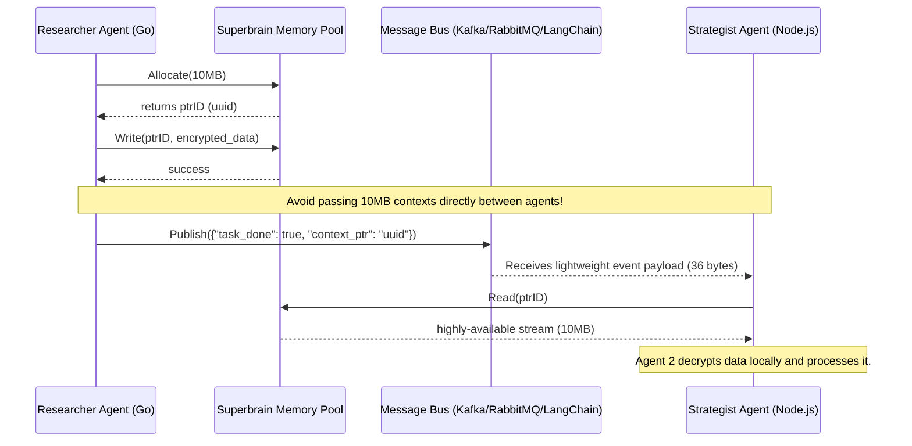
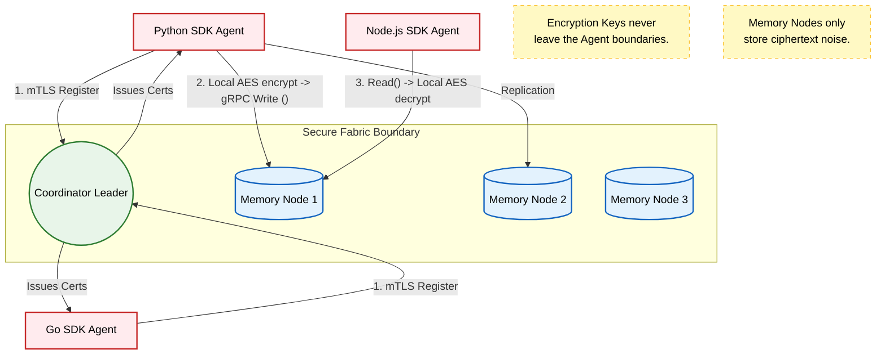

# Superbrain SDK: Comprehensive Consumption Guide

Welcome to the Superbrain SDK! This guide explains how external developers and AI agents can seamlessly consume the Superbrain distributed memory fabric using our multi-language wrappers.

## Table of Contents
1. [Prerequisites](#prerequisites)
2. [Shared Library Setup](#shared-library-setup)
3. [Go SDK Usage](#go-sdk-usage)
4. [Python SDK Usage](#python-sdk-usage)
5. [Node.js / TypeScript SDK Usage](#nodejs--typescript-sdk-usage)
6. [Enterprise mTLS & E2EE](#enterprise-mtls--e2ee)
7. [Architecture & Agent Flow Diagrams](#architecture--agent-flow-diagrams)
8. [API Reference (Godoc Style)](#api-reference-godoc-style)
---

## Prerequisites
Before consuming the SDK in any language, ensure you have:
- A running Superbrain Coordinator (e.g., `localhost:50050` or `localhost:60050` for Secure Fabric).
- At least one active Memory Node attached to the Coordinator.

---

## Shared Library Setup

The core of the Superbrain SDK is a high-performance CGO shared library (`libsuperbrain`). All language wrappers (Go, Python, etc.) interact with this underlying binary.

1. **Download the Binary:** Obtain `libsuperbrain.dylib` (macOS) or `libsuperbrain.so` (Linux). This is located in the `lib/` directory of the `superbrainSdk` repository.
2. **Set Library Path:** Your operating system needs to know where this library lives. Before running your application, export the path:
   ```bash
   # macOS
   export DYLD_LIBRARY_PATH=/path/to/superbrainSdk/lib:$DYLD_LIBRARY_PATH
   
   # Linux
   export LD_LIBRARY_PATH=/path/to/superbrainSdk/lib:$LD_LIBRARY_PATH
   ```

---

## Go SDK Usage

The Go SDK provides a thin idiomatic wrapper around the CGO library.

### Installation
```bash
go get github.com/anispy211/superbrainSdk
```

### Basic Example
```go
package main

import (
    "fmt"
    "github.com/anispy211/superbrainSdk/sdk"
)

func main() {
    // 1. Initialize Client
    client, _ := sdk.NewClient("localhost:50050")

    // 2. Allocate 1MB
    ptrID, _ := client.Allocate(1024 * 1024)

    // 3. Write data
    client.Write(ptrID, 0, []byte("Shared Agent Context"))

    // 4. Read data
    data, _ := client.Read(ptrID, 0, 20)
    fmt.Println(string(data))
    
    // 5. Cleanup
    client.Free(ptrID)
}
```

---

## Python SDK Usage

The Python SDK uses `ctypes` to bridge directly to the shared library, offering native performance without external dependencies.

### Installation
Currently, the Python SDK is distributed as a source package within the repository.
```bash
cd superbrainSdk/python
pip install -e .
```

### Basic Example
```python
from superbrain import Client

# 1. Initialize Client
client = Client("localhost:50050")

# 2. Allocate 1MB
ptr_id = client.allocate(1024 * 1024)

# 3. Write data
client.write(ptr_id, 0, b"Shared Agent Context")

# 4. Read data
data = client.read(ptr_id, 0, 20)
print(data.decode('utf-8'))

# 5. Cleanup
client.free(ptr_id)
```

---

## Enterprise mTLS & E2EE

For production AI deployments, Superbrain offers a **Secure Fabric** via Phase 2 features.

### 1. mTLS Enrollment
Agents must actively enroll to receive short-lived certificates from the Coordinator CA.
```go
// Go
client, _ := sdk.NewClient("localhost:60050")
client.Register("agent-name-1")
```
```python
# Python
client = Client("localhost:60050")
client.register("agent-name-1")
```

### 2. End-to-End Encryption (AES-GCM-256)
If you require strict data privacy (e.g., healthcare workflows), initialize the client with a 32-byte key. *Data never leaves the SDK unencrypted.*

```go
// Go
key := []byte("your-32-byte-long-secret-key-123")
secureClient, _ := sdk.NewClientWithEncryption(key, "localhost:60050")
```
```python
# Python
key = b"your-32-byte-long-secret-key-123"
secure_client = Client("localhost:60050", encryption_key=key)
```

> **Important Data Overhead Note:**
> When E2EE is enabled, the SDK uses AES-GCM which appends 28 bytes of overhead (a 12-byte nonce and a 16-byte authentication tag) to your plaintext.
> 
> Therefore, when calling `Read()`, you **must** request `length + 28` bytes to successfully decrypt the payload.
> 
> ```python
> # Example: Reading a 100-byte encrypted payload
> deciphered_bytes = secure_client.read(ptr_id, 0, 100 + 28)
> ```

---

## Node.js / TypeScript SDK Usage

The TypeScript wrapper uses `koffi` (a fast, modern FFI module for Node.js) to interact seamlessly with the CGO binary.

### Installation
```bash
cd superbrainSdk/node
npm install
```

### Basic Example
```typescript
import { Client } from './index';

// 1. Initialize Client
const client = new Client('localhost:50050');
client.register("typescript-agent");

// 2. Allocate 1MB (returns string UUID)
const data = Buffer.from("Shared context via Koffi!", "utf-8");
const ptrId = client.allocate(data.length);

// 3. Write data
client.write(ptrId, 0, data);

// 4. Read data
const readBuf = client.read(ptrId, 0, data.length);
console.log(readBuf.toString('utf-8'));

// 5. Cleanup
client.free(ptrId);
```

---

## Architecture & Agent Flow Diagrams

To help visualize how Superbrain replaces traditional gRPC payloads with a fast, distributed shared memory pool, refer to these architecture and interaction maps.

### 1. Multi-Agent Memory Flow (Pub/Sub via Pointers)

Instead of passing massive 10MB context blobs between agents, agents pass lightweight 36-byte pointer UUIDs over a message queue (or agent framework state).



### 2. Phase 2 Secure Fabric Architecture

When E2EE and mTLS are enabled, the Coordinator acts as a Certificate Authority. Data is purely encrypted noise when resting in Memory Nodes.



---

## API Reference (Godoc Style)

This section maps directly to the Go SDK methods (`pkg/sdk/client.go`), which are exposed to Python and Node.js with identical signatures.

### `NewClient(coordinatorAddr string) (*Client, error)`
Initializes a new Superbrain SDK client.
*   **Args**: 
    *   `coordinatorAddr`: Host and port of the Superbrain Coordinator (e.g., `"localhost:50050"`).
*   **Returns**: A `Client` instance.
*   **Errors**: Connection refused, dial timeout.

### `NewClientWithEncryption(key []byte, coordinatorAddr string) (*Client, error)`
Initializes a Secure SDK client that automatically encrypts/decrypts data locally.
*   **Args**:
    *   `key`: Exactly 32 bytes for `AES-GCM-256`.
    *   `coordinatorAddr`: Host and port.
*   **Returns**: A `Client` instance.
*   **Errors**: Key length mismatch, connection failure.

### `Client.Register(agentID string) error`
Registers the agent with the Secure Fabric and obtains mTLS certificates.
*   **Args**:
    *   `agentID`: A unique string identifier (e.g., `"researcher-bot"`).
*   **Returns**: None on success.
*   **Errors**: Unauthorized, Coordinator unreachable.

### `Client.Allocate(size uint64) (*Pointer, error)`
Requests a chunk of distributed memory across the cluster.
*   **Args**:
    *   `size`: Number of bytes requested.
*   **Returns**: A `Pointer` struct containing the 36-character `ID`.
*   **Errors**: `not enough healthy nodes` (check cluster size vs replication factor).

### `Client.Write(ptr *Pointer, offset uint64, data []byte) error`
Writes binary data to an allocated pointer. If encryption is enabled, data is encrypted *before* transmission.
*   **Args**:
    *   `ptr`: The pointer instance retrieved from `Allocate()`.
    *   `offset`: Starting byte offset (usually `0`).
    *   `data`: The payload to store.
*   **Returns**: None on success.
*   **Errors**: `write out of bounds`, node disconnected midway.

### `Client.Read(ptr *Pointer, offset uint64, length uint64) ([]byte, error)`
Reads data back from the memory pool. If encryption is enabled, it automatically decrypts the ciphertext.
*   **Args**:
    *   `ptr`: The pointer instance.
    *   `offset`: Byte offset to start reading.
    *   `length`: Number of bytes to read. *(Note: Add 28 bytes to length if E2EE overhead is active).*
*   **Returns**: The original plaintext data.
*   **Errors**: `read out of bounds`, tag authentication failed (bad encryption key).

### `Client.Free(ptr *Pointer) error`
Releases the distributed memory back to the pool.
*   **Args**:
    *   `ptr`: The pointer to free.
*   **Returns**: None on success.
*   **Errors**: Pointer already freed or not found.
